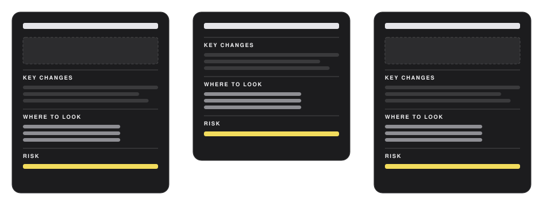

<p align="center">
  
</p>

<h3 align="center">Merge request descriptions a reviewer actually reads.</h3>

<p align="center">
  <a href="LICENSE"></a>
  <a href="https://github.com/kenjione/mr-brief/actions/workflows/check.yml"></a>
</p>

<p align="center">
  A Claude Code skill that turns a diff into a fifteen-line brief: what changed, the three decisions worth arguing about, three verified places to look, one risk. A diagram only when the wiring moved. It asks before it writes, and never touches the MR without a second yes.
</p>

## Install

```bash
claude plugin marketplace add kenjione/mr-brief
claude plugin install mr-brief@mr-brief
```

Then, on a branch that is ready for review:

```
/mr-brief
```

Or paste this into Claude Code and let it do the install: *Install the mr-brief plugin from https://github.com/kenjione/mr-brief.*

Or just open the MR as usual — `glab mr create`, `gh pr create` — and mr-brief offers itself once, in one line. Say no and it stays quiet for that branch. Works with GitLab and GitHub.

## Same shape, every MR

<p align="center"></p>

The same four blocks, in the same order, with a line between them. Reviewers learn the layout once and know where the risk line is before the page loads. That is the whole idea; everything else is enforcement.

## What you get

````markdown
<!-- mr-brief v1 -->  BILL-412 · 2 of 2 · after payments-api!318

Cancelling a subscription now also cancels every add-on billed against it.

**Architecture:** billing now calls the payments API for the first time, from a nightly sweep.

```mermaid
sequenceDiagram … the scenario end to end, what is new marked in yellow
```

### Key changes
- **Cancelled state is re-read from the provider every sweep** — a stale copy cannot keep an add-on billing
- **The sweep is fail-soft per subscription** — one unreachable provider no longer aborts the rest
- **A 404 from the cancel call counts as success** — no add-ons, still cancelled

### Where to look · ~8 min · skip the 300 lines of specs
- [ ] **Start →** [poll_subscriptions_worker.rb:45](…#L45) — where a cancelled flag becomes a cascade
- [ ] [addon_cancellation.rb:21](…#L21) — 404 swallowed into false; the arguable bit
- [ ] [poll_subscriptions_worker_spec.rb:92](…#L92) — proves a failing cascade does not stop the sweep

### Risk
> an add-on keeps billing after cancellation — visible as `last_error`, retried. Not silent.
> Rollback: flip the polling setting off.
````

Every link is a permalink that was checked against the commit before it was written. Every line is there because it removes reading: a picture instead of a paragraph, a link instead of a path, a bold claim instead of a sentence to parse, a `skip:` instead of forty files opened for nothing.

## The rules

| | |
|---|---|
| **15 lines** of text, hard limit | the diagram does not count |
| **3** key changes | each a decision someone could disagree with, most contentious first |
| **3** places to look | verified permalinks, caller before callee, with a minutes estimate and a `skip:` |
| **1** risk line | worst realistic outcome, loud or silent, how to roll back |
| **Architecture** | one line and one sequence across services — only when a service now calls one it did not |
| **Diagram** | only when a call path, state machine, job or webhook moved; what is new marked |

If the change will not fit in three claims, the skill says so before writing: *split this, or the reviewer skims.*

## Opt-in, on purpose

A description appearing under your name that you did not ask for is a failure, however good it is. So:

- The offer fires from a hook on the command that opens the MR — once per branch, recorded in `.git/`.
- **No** is final for that branch. **Yes** writes the brief into the conversation; attaching it to the MR takes a second yes.
- `touch ~/.claude/.mr-brief-always` to skip the question. Attaching still asks.
- Prefer `/mr-brief` only? Delete `hooks/hooks.json` after install.

## Runtimes

| | |
|---|---|
| **Claude Code** | full: skill, the once-per-branch offer, `/mr-brief` — tested |
| **Cursor** | `.cursor/skills/mr-brief/` (synced copy) — packaged, not yet tested |
| **Codex** | `.codex-plugin/` + `.agents/plugins/marketplace.json` — packaged, not yet tested |
| **Gemini CLI** | `gemini-extension.json` + `GEMINI.md` — packaged, not yet tested |
| **OpenCode** | `.opencode/command/mr-brief` — packaged, not yet tested |
| **Kimi Code** | `kimi.plugin.json` — packaged, not yet tested |

The skill is one Markdown file and the scripts are plain Node, so any agent that reads
instructions can run it. Only Claude Code has the hook that offers the brief at the moment
an MR is opened; elsewhere you ask for it.

## What ships

```
skills/mr-brief/SKILL.md          the rules
skills/mr-brief/reference/        how and when to draw
hooks/offer.mjs                   the once-per-branch offer
scripts/anchor.mjs                path:line → permalink, refuses a line that does not exist
scripts/lint.mjs                  checks a brief against the contract
scripts/siblings.mjs              open MRs sharing the branch's ticket key (GitLab)
templates/                        the empty shape for GitLab and GitHub — usable with no agent at all
ci/                               drop-in jobs that lint a description and comment, never block
evals/                            lint fixtures, a real-run harness, a rubric
```

`node scripts/lint.mjs brief.md` is the same check the skill runs before handing over. The template alone — `templates/gitlab/Brief.md` in `.gitlab/merge_request_templates/` — gives a team the shape without the agent.

## Why this shape

Review effectiveness collapses past a few hundred changed lines; reviewers stop reading and start approving. A longer description does not fix that — it is the same failure one screen earlier. What moves review outcomes is a description that gets *finished*: short, ordered the way the code should be read, with nothing in it that a reviewer has to take on trust.

MIT licensed.
