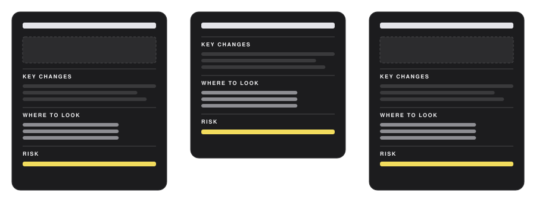

<p align="center">
  
</p>

<h3 align="center">Merge request descriptions a reviewer actually reads.</h3>

<p align="center">
  <a href="LICENSE"></a>
  <a href="https://github.com/kenjione/mr-brief/actions/workflows/check.yml"></a>
</p>

<p align="center">
  A Claude Code skill that turns a diff into a fifteen-line brief: what changed, the three decisions worth arguing about, three verified places to look, one risk. A diagram only when the wiring moved, and under the fold a reading guide: which eight files to open, what changed in each, the decisive hunk of every one. It asks before it writes, and never touches the MR without a second yes.
</p>

## Install

```bash
claude plugin marketplace add kenjione/mr-brief
claude plugin install mr-brief@mr-brief
```

Then, on a branch that is ready for review:

```
/mr-brief
```

Or paste this into Claude Code and let it do the install: *Install the mr-brief plugin from https://github.com/kenjione/mr-brief.*

Or just open the MR as usual — `glab mr create`, `gh pr create` — and mr-brief offers itself once, in one line. Say no and it stays quiet for that branch. Works with GitLab and GitHub.

## Same shape, every MR

<p align="center"></p>

The same four blocks, in the same order, with a line between them. Reviewers learn the layout once and know where the risk line is before the page loads. That is the whole idea; everything else is enforcement.

## What you get

````markdown
<!-- mr-brief v1 -->  BILL-412 · 2 of 2 · after payments-api!318

Cancelling a subscription now also cancels every add-on billed against it.

**Architecture:** billing now calls the payments API for the first time, from a nightly sweep.


*Yellow: added by this MR — the sweep worker, and the cancel call it makes.*

### Key changes
- **Cancelled state is re-read from the provider every sweep** — a stale copy cannot keep an add-on billing
- **The sweep is fail-soft per subscription** — one unreachable provider no longer aborts the rest
- **A 404 from the cancel call counts as success** — no add-ons, still cancelled

### Where to look · ~8 min · skip the 300 lines of specs
**Start →** [poll_subscriptions_worker.rb:12](…#L12) — the nightly sweep starts here; follow `perform` down
- [ ] [poll_subscriptions_worker.rb:45](…#L45) — is the cancelled flag read from the provider, never from the cached expiry? · key change 1
- [ ] [addon_cancellation.rb:21](…#L21) — is a 404 the only answer turned into success? · key change 3
- [ ] [poll_subscriptions_worker_spec.rb:92](…#L92) — does one failing subscription leave the rest of the run going? · key change 2

### Risk
> an add-on keeps billing after cancellation — visible as `last_error`, retried. Not silent.
>
> Rollback: flip the polling setting off.

---
▸ **Reading guide** — 3 files worth opening, with their hunks · what to skip · glossary
````

Every link was checked against the commit before it was written, and on an open MR it lands in the MR's own changes tab at that line — the reviewer reads and comments in one place. Every line is there because it removes reading: a picture instead of a paragraph, a link instead of a path, a bold claim instead of a sentence to parse, a `skip:` instead of forty files opened for nothing.

## From diff to description

1. **Sort the diff.** `focus.mjs` splits the changed files into core / tests / views /
   config / generated and names the pure renames. On a 20-file MR that is typically 8 files
   to read and 12 to skip — the `skip:` line is written from these counts, not by feel.
2. **Write the brief** from the core diff: one sentence, the architecture line and its
   picture when a service now calls one it did not, three key changes, three verified
   permalinks, one risk. The picture is written as data — a graph document with a `delta`
   on every node and arrow — and drawn by a script: SVGs from the PR Lens renderer where
   `npx` is available, mermaid compiled from the same document everywhere else. Nobody
   types mermaid, and every file a node names is checked against the commit first.
3. **Add the reading guide** under the fold: for each core file, *what changed · what to
   check* and its decisive hunk as a `diff` block — ten lines at most, cut by `excerpt.mjs`
   from the real diff. Then the files to skip and the files that only moved. The reviewer
   reads the code with its explanation in one place, before opening a single file.
4. **Preview it** — `preview.mjs` renders the brief with GitLab's or GitHub's own Markdown
   API, draws the mermaid, and toggles both themes. What you approve is what the reviewer
   will see.
5. **Attach** — only on your second yes.

## The rules

| | |
|---|---|
| **15 lines** of text, hard limit | the diagram does not count |
| **Why** | one or two sentences on the need or the problem, readable without the spec |
| **3** key changes | each a decision someone could disagree with, most contentious first |
| **3** places to look | one per key change: the question a reviewer answers at the changed line that decides it, linked into the MR's diff, with a minutes estimate and a `skip:` |
| **1** risk line | worst realistic outcome, loud or silent, how to roll back |
| **Architecture** | one line and one sequence across services — only when a service now calls one it did not |
| **Diagram** | only when a call path, state machine, job or webhook moved; what is new marked — a rendered SVG, or mermaid folded where an image cannot be shown; never both |
| **Reading guide** | under the fold: ≤ 8 files, each with one line and one hunk of ≤ 10 diff lines; renames are one line for all |
| **Series line** | one line at the top when the MR is one of a set — the same in every MR of the set |

If the change will not fit in three claims, the skill says so before writing: *split this, or the reviewer skims.*

## Opt-in, on purpose

A description appearing under your name that you did not ask for is a failure, however good it is. So:

- The offer fires from a hook on the command that opens the MR — once per branch, recorded in `.git/`.
- **No** is final for that branch. **Yes** writes the brief into the conversation; attaching it to the MR takes a second yes.
- `touch ~/.claude/.mr-brief-always` to skip the question. Attaching still asks.
- After a push past the commit the brief describes, a second hook asks one line: *refresh it?* GitLab links stay pinned to the version they were written for, so an old brief never sends a reader to the wrong line.
- Prefer `/mr-brief` only? Delete `hooks/hooks.json` after install.

## Before anyone reads it

Every key change and risk goes to a second reader before you see the brief: a separate agent with none of the writer's context reads the code behind each claim, library sources included, and answers *supported*, *contradicted* or *unsupported*. What it cannot back is rewritten or dropped. Then it reads the diff for what the brief left out — who is acting, what can happen twice, who gets to see what, whether the off-switch works — and the worst of it goes into Risk. The reading guide is built by a smaller-model agent, so a large MR does not cost the writer's budget file by file.

## Reviewing an MR that has no brief

`/mr-brief review 2710` fetches someone else's MR without touching your checkout and writes the same reading guide for you, with three questions to settle instead of key changes. It stays on your machine: nothing is attached, uploaded or posted.

## Is it working?

`node scripts/metrics.mjs --days 30` lines up merged MRs with and without a brief: hours to the first review comment, review comments per MR, MRs merged with no review comment at all, and how many *Where to look* boxes reviewers ticked. Read-only. On the repo it was first run on, 35 of 38 MRs in a month were merged without a single review comment — that is the number to move.

## Runtimes

| | |
|---|---|
| **Claude Code** | full: skill, the once-per-branch offer, `/mr-brief` — tested |
| **Cursor** | `.cursor/skills/mr-brief/` (synced copy) — packaged, not yet tested |
| **Codex** | `.codex-plugin/` + `.agents/plugins/marketplace.json` — packaged, not yet tested |
| **Gemini CLI** | `gemini-extension.json` + `GEMINI.md` — packaged, not yet tested |
| **OpenCode** | `.opencode/command/mr-brief` — packaged, not yet tested |
| **Kimi Code** | `kimi.plugin.json` — packaged, not yet tested |

The skill is one Markdown file and the scripts are plain Node, so any agent that reads
instructions can run it. Only Claude Code has the hook that offers the brief at the moment
an MR is opened; elsewhere you ask for it.

## Updates

Claude Code does not check for plugin updates on its own — a plugin stays at the version
it was installed at until you run `claude plugin update mr-brief@mr-brief`. So mr-brief
checks for you: once a day, at session start, it reads the published `plugin.json` from
this repository and, if the version is higher than yours, says so once:

```
mr-brief 0.4.0 is out (you have 0.3.2). Update: claude plugin update mr-brief@mr-brief
```

The check has a 1.5-second timeout and fails silently. It sends nothing but the request;
GitHub sees your IP, as it does when you clone. To turn it off:
`touch ~/.claude/.mr-brief-no-update-check`. What changed in each version is in
[CHANGELOG.md](CHANGELOG.md).

## What ships

```
skills/mr-brief/SKILL.md          the rules
skills/mr-brief/reference/        how and when to draw
hooks/offer.mjs                   the once-per-branch offer
hooks/update-check.mjs            once a day, tells you when a newer version is published
hooks/stale.mjs                   after a push, says when the MR's brief describes an older commit
agents/claim-checker.md           the second reader: every claim checked against the code
agents/reading-guide.md           builds the reading guide on a smaller model
scripts/anchor.mjs                path:line → a link into the MR's diff at that line (or a permalink), refuses a line that does not exist
scripts/lint.mjs                  checks a brief against the contract; --head says whether it is stale
scripts/attach.mjs                puts the brief on the MR, stamped with the commit it describes
scripts/claims.mjs                the packet the claim-checker reads: claims + the code behind every link
scripts/mr-ref.mjs                someone else's MR as refs, for review mode — no checkout
scripts/metrics.mjs               merged MRs with and without a brief, side by side
scripts/siblings.mjs              open MRs sharing the branch's ticket key (GitLab)
scripts/focus.mjs                 sorts the diff into read-closely / skip, names the renames
scripts/preview.mjs               the brief as the MR page will show it — platform renderer + mermaid, both themes
scripts/excerpt.mjs               the decisive hunk of a file as a diff block, ten lines at most, for the reading guide
scripts/render.mjs                draws both pictures with the PR Lens renderer and uploads them to the MR (GitLab)
scripts/compile.mjs               the same graph document as mermaid — the model never writes mermaid by hand
templates/                        the empty shape for GitLab and GitHub — usable with no agent at all
ci/                               drop-in jobs that lint a description, flag a stale one, and comment — never block
evals/                            lint fixtures, a real-run harness, a rubric
```

`node scripts/lint.mjs brief.md` is the same check the skill runs before handing over. The template alone — `templates/gitlab/Brief.md` in `.gitlab/merge_request_templates/` — gives a team the shape without the agent.

## Why this shape

Review effectiveness collapses past a few hundred changed lines; reviewers stop reading and start approving. A longer description does not fix that — it is the same failure one screen earlier. What moves review outcomes is a description that gets *finished*: short, ordered the way the code should be read, with nothing in it that a reviewer has to take on trust.

MIT licensed. Pictures are drawn with the [PR Lens](https://github.com/coldteadotai/pr-lens) renderer, also MIT. Writing the picture as a graph and compiling it, instead of letting the model type mermaid, is [gitdiagram](https://github.com/ahmedkhaleel2004/gitdiagram)'s idea, also MIT.
