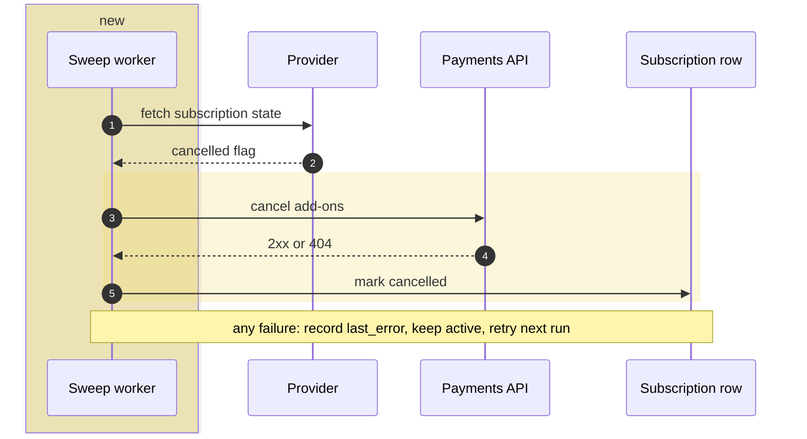

<!-- mr-brief v1 -->  BILL-412 · 2 of 2 · after payments-api!318

Cancelling a subscription now also cancels every add-on billed against it.

**Why:** a cancelled customer kept paying for add-ons, because nothing told the payments side the subscription had ended.

**Architecture:** billing now calls the payments API for the first time, from a nightly sweep. Nothing removed.

*Yellow: added by this MR — the sweep worker, and the cancel call it makes.*

### Key changes
- **Cancelled state is re-read from the provider every sweep** — never from the cached expiry, so a stale copy cannot keep an add-on billing
- **The sweep is fail-soft per subscription** — one unreachable provider no longer aborts the rest of the run
- **A 404 from the cancel call counts as success** — it means there were no add-ons, and the subscription is still marked cancelled

### Where to look · ~8 min · skip the 300 lines of specs and the migration
- [ ] **Start →** [poll_subscriptions_worker.rb:45](https://gitlab.example.com/billing/core/-/blob/3f9c2a7d1e04b6c8a5f0d2e9b7c1a4f6e8d0b2c3/app/workers/billing/poll_subscriptions_worker.rb#L45) — is the cancelled flag read from the provider here, never from the cached expiry? · key change 1
- [ ] [addon_cancellation.rb:21](https://gitlab.example.com/billing/core/-/blob/3f9c2a7d1e04b6c8a5f0d2e9b7c1a4f6e8d0b2c3/lib/payments/addon_cancellation.rb#L21) — is a 404 the only answer turned into success, while every other error still fails? · key change 3
- [ ] [poll_subscriptions_worker_spec.rb:92](https://gitlab.example.com/billing/core/-/blob/3f9c2a7d1e04b6c8a5f0d2e9b7c1a4f6e8d0b2c3/spec/workers/billing/poll_subscriptions_worker_spec.rb#L92) — does one subscription that fails leave the rest of the run going? · key change 2

### Risk
> an add-on keeps billing after its subscription was cancelled — visible as `last_error` on the row and retried next sweep, not silent.
>
> Rollback: flip `billing.subscription_polling_enabled` to false; a full revert also needs the diagnostics migration rolled back.

---

<strong>Reading guide</strong> — the sweep worker's hunk · what to skip · settings and tests

- Settings in `config/settings.yml`; schedule in `config/sidekiq.yml` (low-priority queue, every 12-24h)
- Migration adds `last_attempt_at` and `last_error` to `subscriptions`
- The provider side of the cancel endpoint lands in a follow-up MR
- Specs cover cancelled / active / already-cancelled / 404 / 5xx / unreachable provider / truncation

**Reading guide**

**[f1.rb:1](https://gitlab.com/g/r/-/blob/aaaaaaaaaaaaaaaaaaaaaaaaaaaaaaaaaaaaaaaa/f1.rb#L1)** — x · y

**[f2.rb:2](https://gitlab.com/g/r/-/blob/aaaaaaaaaaaaaaaaaaaaaaaaaaaaaaaaaaaaaaaa/f2.rb#L2)** — x · y

**[f3.rb:3](https://gitlab.com/g/r/-/blob/aaaaaaaaaaaaaaaaaaaaaaaaaaaaaaaaaaaaaaaa/f3.rb#L3)** — x · y

**[f4.rb:4](https://gitlab.com/g/r/-/blob/aaaaaaaaaaaaaaaaaaaaaaaaaaaaaaaaaaaaaaaa/f4.rb#L4)** — x · y

**[f5.rb:5](https://gitlab.com/g/r/-/blob/aaaaaaaaaaaaaaaaaaaaaaaaaaaaaaaaaaaaaaaa/f5.rb#L5)** — x · y

**[f6.rb:6](https://gitlab.com/g/r/-/blob/aaaaaaaaaaaaaaaaaaaaaaaaaaaaaaaaaaaaaaaa/f6.rb#L6)** — x · y

**[f7.rb:7](https://gitlab.com/g/r/-/blob/aaaaaaaaaaaaaaaaaaaaaaaaaaaaaaaaaaaaaaaa/f7.rb#L7)** — x · y

**[f8.rb:8](https://gitlab.com/g/r/-/blob/aaaaaaaaaaaaaaaaaaaaaaaaaaaaaaaaaaaaaaaa/f8.rb#L8)** — x · y

**[f9.rb:9](https://gitlab.com/g/r/-/blob/aaaaaaaaaaaaaaaaaaaaaaaaaaaaaaaaaaaaaaaa/f9.rb#L9)** — x · y

