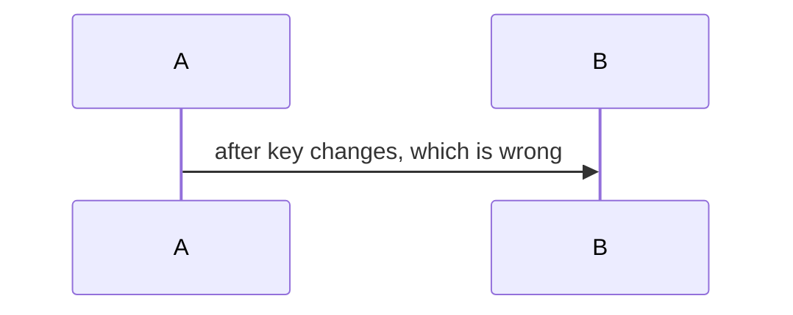

Missing the marker line.

- **Claim** — reason

**Where to look** · ~3 min
- [ ] [a.rb:1](https://x.example/-/blob/s/a.rb#L1) — a
- [ ] [b.rb:2](https://x.example/-/blob/s/b.rb#L2) — b
- [ ] [c.rb:3](https://x.example/-/blob/s/c.rb#L3) — c

**Architecture:**

> **Risk:** r.

no blank lines

- x

