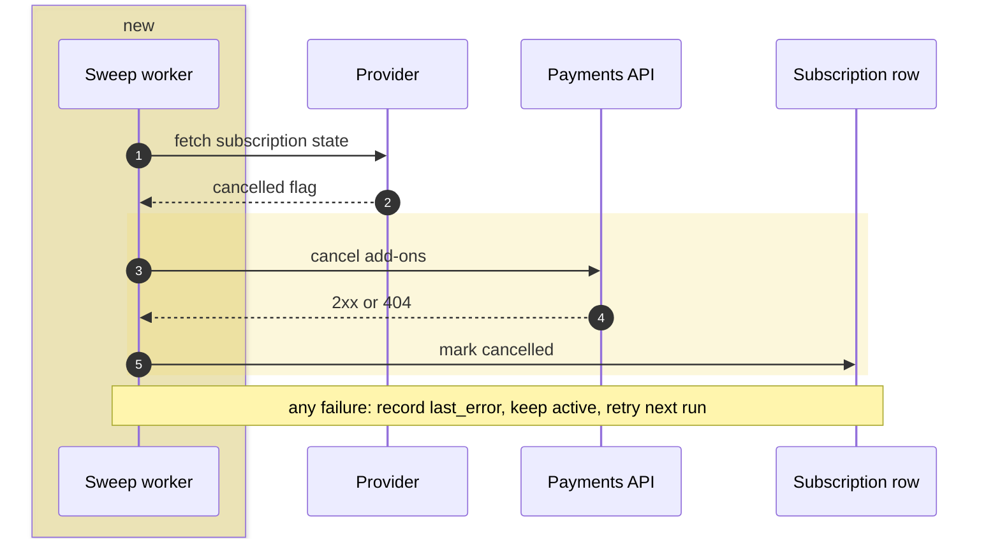

<!-- mr-brief v1 -->  BILL-412 · 2 of 2 · after payments-api!318

Cancelling a subscription now also cancels every add-on billed against it.

**Architecture:** billing now calls the payments API for the first time, from a nightly sweep. Nothing removed.

*Yellow: added by this MR — the sweep worker, and the cancel call it makes.*

**Key changes**
- **Cancelled state is re-read from the provider every sweep** — never from the cached expiry, so a stale copy cannot keep an add-on billing
- **The sweep is fail-soft per subscription** — one unreachable provider no longer aborts the rest of the run
- **A 404 from the cancel call counts as success** — it means there were no add-ons, and the subscription is still marked cancelled

**Where to look** · ~8 min · skip the 300 lines of specs and the migration
- [ ] **Start →** [poll_subscriptions_worker.rb:45](https://gitlab.example.com/billing/core/-/blob/3f9c2a7d1e04b6c8a5f0d2e9b7c1a4f6e8d0b2c3/app/workers/billing/poll_subscriptions_worker.rb#L45) — where a cancelled flag becomes a cascade
- [ ] [addon_cancellation.rb:21](https://gitlab.example.com/billing/core/-/blob/3f9c2a7d1e04b6c8a5f0d2e9b7c1a4f6e8d0b2c3/lib/payments/addon_cancellation.rb#L21) — 404 swallowed into `false`; the decision most worth arguing about
- [ ] [poll_subscriptions_worker_spec.rb:92](https://gitlab.example.com/billing/core/-/blob/3f9c2a7d1e04b6c8a5f0d2e9b7c1a4f6e8d0b2c3/spec/workers/billing/poll_subscriptions_worker_spec.rb#L92) — proves a failing cascade does not stop the sweep

> **Risk:** an add-on keeps billing after its subscription was cancelled — visible as `last_error` on the row and retried next sweep, not silent.
> Rollback: flip `billing.subscription_polling_enabled` to false; a full revert also needs the diagnostics migration rolled back.

Scope, settings and tests

- Settings in `config/settings.yml`; schedule in `config/sidekiq.yml` (low-priority queue, every 12-24h)
- Migration adds `last_attempt_at` and `last_error` to `subscriptions`
- The provider side of the cancel endpoint lands in a follow-up MR
- Specs cover cancelled / active / already-cancelled / 404 / 5xx / unreachable provider / truncation

